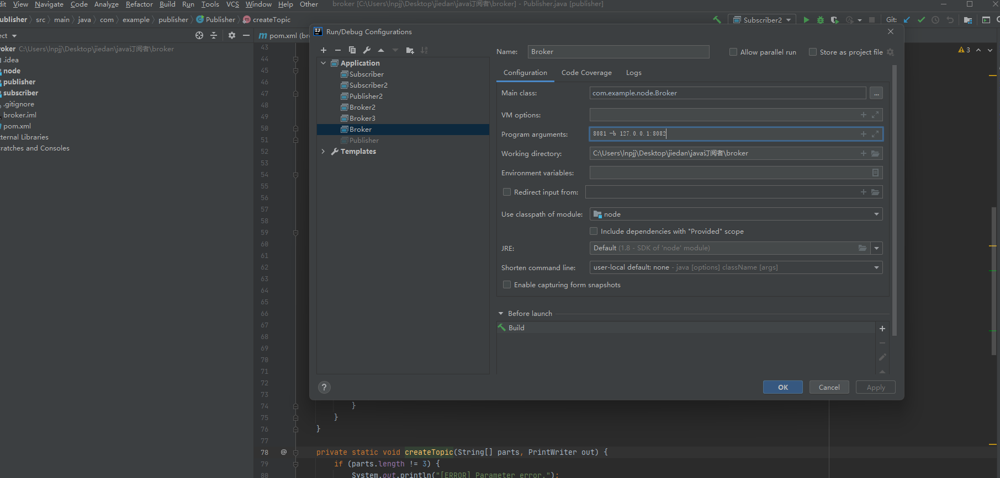

## Introduction
Publisher-subscriber (pub-sub) systems are widely used architectural patterns in distributed systems, providing advantages such as component decoupling, scalability, and real-time communication. These systems allow publishers to send messages about various topics without knowing the subscribers, and subscribers can receive updates about topics they are interested in without knowing the publishers. In this assignment, you will develop a simplified distributed publisher-subscriber (pub-sub) system using a proxy network, implemented through Socket programming or RMI. The system should allow publishers and subscribers to interact with the proxy network, seamlessly support multiple topics, and facilitate real-time message distribution.

## Environmental requirements
* Install JDK, 1.8 or above
* Install Maven

## Startup method

### Run with idea
Open the project with idea and configure the run parameters in program arguments.
The parameter of broker is "port -b ip:port"
The parameter of subscriber is "username ip:port"
The parameter of publisher is "username ip:port"

### Run as jar package
1. Open the project with idea, and Maven on the right. Find broker->Lifecycle->package and double-click to package.
2. The jar packages are in the target directories of node, publisher, and subscriber respectively.
3. Use commands to run the jar packages of broker, subscriber, and publisher in turn, and add some running parameters.
Broker command: java -jar broker.jar port -b ip:port
Subscriber command: java -jar subscriber.jar username ip:port
Publisher command: java -jar publisher.jar username ip:port

## Usage

After the project is running, a simple test process is as follows:
In the publisher's console, create a topic: create topicID topicName
In the subscriber's console, subscribe to the topic: subscribe topicID
In the publisher's console, send a message: publish topicID message
Check the subscriber console to see if the message can be received.

### All command functions

**Publisher**

* Create a topic: create topicID topicName
* Publish a message: publish topicID message
* Display the number of topic subscribers: show topicID
* Delete a topic: delete topicID

**Subscriber**

* Display all topics: display
* Subscribe to a topic: subscribe topicID
* Display the current subscription status of the subscriber: current
* Unsubscribe: unsubscribe topicID